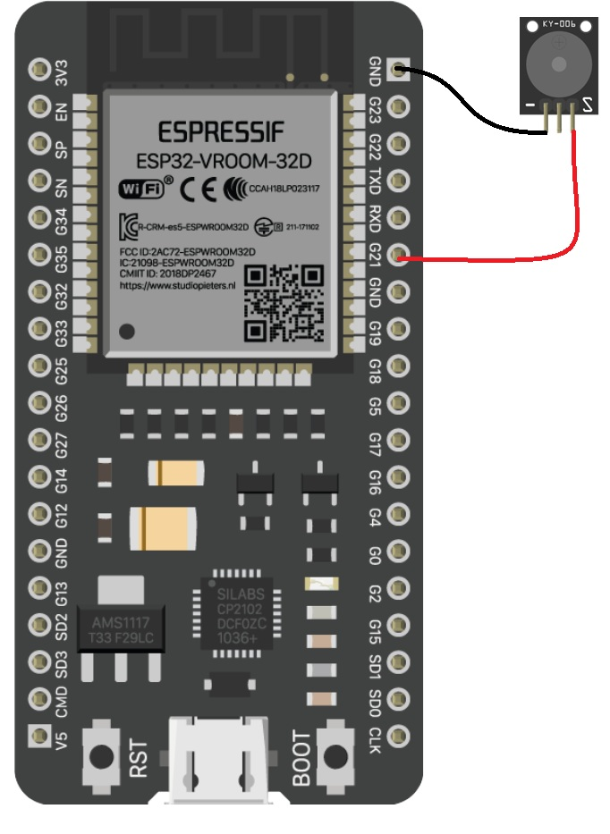

# ESP32 I-Remember Notification System

A simple IoT notification system using ESP32 that checks for notifications from a remote API and alerts the user with a buzzer sound.

## Overview

This project consists of two main components:
1. **ESP32 Arduino Code** (`main.ino`) - Microcontroller firmware that polls the API for notifications
2. **Python Desktop Controller** (`main.py`) - Desktop application to trigger notifications

## Features

- 🔔 **Real-time Notification Polling** - ESP32 checks for notifications every 5 seconds
- 🔊 **Audio Alerts** - Buzzer plays notification sounds when alerts are received
- 📡 **WiFi Connectivity** - Automatic WiFi connection with reconnection handling
- 🖥️ **Desktop Controller** - Simple GUI to send notifications
- 🔒 **Secure API** - JWT token-based authentication
- ⚡ **Low Power** - Efficient polling with task delays

## Hardware Requirements

- ESP32 Development Board
- Buzzer (connected to Pin 21)
- WiFi Network Access

## Circuit Diagram



**Pin Connections:**
- Buzzer positive → GPIO 21
- Buzzer negative → GND

## Software Requirements

### ESP32 (Arduino IDE)
- ArduinoJson library
- WiFi library (built-in)
- HTTPClient library (built-in)

### Python Controller
- Python 3.x
- tkinter (usually included with Python)

## Installation & Setup

### 1. ESP32 Setup

1. Install the required libraries in Arduino IDE:
   ```
   ArduinoJson by Benoit Blanchon
   ```

2. Configure your WiFi credentials in `main.ino`:
   ```cpp
   const char* WIFI_SSID = "Your_WiFi_Name";
   const char* WIFI_PASSWORD = "Your_WiFi_Password";
   ```

3. Upload the code to your ESP32

### 2. Python Controller Setup

1. Run the Python script:
   ```bash
   python main.py
   ```

## Configuration

### API Settings
The system connects to: `https://i-remember.onrender.com/api/i-remember`

### Hardware Settings
- **Buzzer Pin**: GPIO 21
- **Buzzer Frequency**: 2000 Hz
- **Check Interval**: 5 seconds
- **WiFi Timeout**: 10 seconds

## Usage

1. **Power on the ESP32** - It will automatically connect to WiFi
2. **Monitor Serial Output** - Check connection status and notifications
3. **Use Python Controller** - Click "Send Notification" to trigger alerts
4. **ESP32 Response** - The buzzer will play when notifications are received

## How It Works

1. ESP32 connects to WiFi network
2. Every 5 seconds, it makes a GET request to check for notifications
3. If `notify: 1` is received, the buzzer plays an alert sound
4. ESP32 automatically sends a PUT request to reset `notify: 0`
5. Python controller can set `notify: 1` via PUT request

## API Endpoints

- **GET** `/api/i-remember` - Check notification status
- **PUT** `/api/i-remember` - Update notification status

## Troubleshooting

### WiFi Connection Issues
- Verify SSID and password are correct
- Check WiFi signal strength
- Monitor serial output for connection status

### No Notifications Received
- Verify API endpoint is accessible
- Check JWT token validity
- Ensure proper network connectivity

### Buzzer Not Working
- Check pin connections (GPIO 21)
- Verify buzzer polarity
- Test with different buzzer frequencies

## Code Structure

### ESP32 (`main.ino`)
- `connectToWiFi()` - Handles WiFi connection
- `checkNotification()` - Polls API for notifications
- `updateNotifyStatus()` - Resets notification flag
- `playNotification()` - Controls buzzer alerts

### Python (`main.py`)
- `make_http_request()` - Sends notification trigger
- `send_notification()` - GUI button handler
- Tkinter GUI for user interaction

## License

This project is part of the HamzaY-Youtube educational content series.

## Support

For issues and questions, please refer to the main project repository or educational content series.